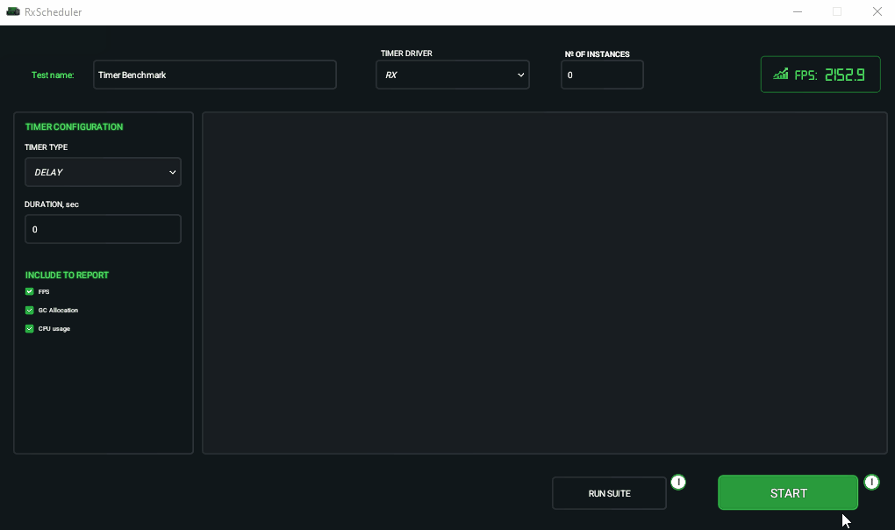
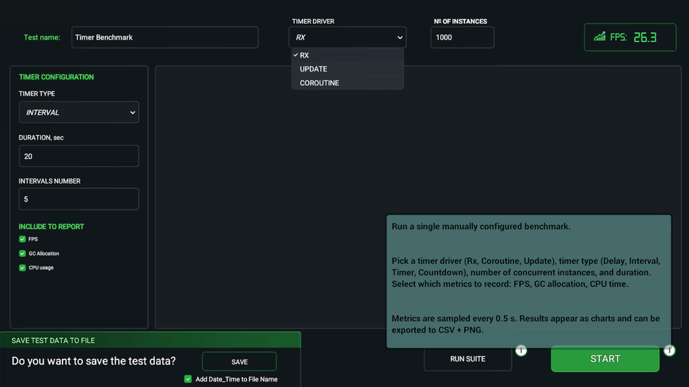
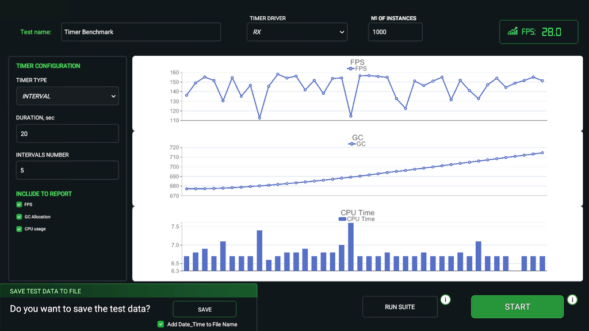

# Unity Timer Benchmark Tool

---

| Main UI | Results |
|---|---|
|  |  |

---

## Motivation

Choosing a timer implementation in Unity is not an obvious decision. RX is syntactically convenient, coroutines are familiar, Update-loop is predictable. But how do they behave under load?

This tool was built to answer practical questions:
- For a game with hundreds of units each using a timer - which implementation produces less GC pressure?
- Is there a CPU time difference between approaches at scale?
- How stable is FPS when running 1000 timers concurrently?

Benchmark results are available at [unity-timer-benchmark](https://github.com/Alex-id1/unity-timer-benchmark).

---

## Architecture

The project follows the **MVP** (Model-View-Presenter) pattern: views are passive and contain no logic, `BenchmarkPresenter` is the sole orchestrator - it owns all services, subscribes to view events and manages the runner lifecycle. `AppInstaller` acts as a **Composition Root** - the single place where all dependencies are created and wired together.

**`ITimer` / `ITimerFactory` - Strategy.** All three implementations are hidden behind a single interface. Benchmark code has no knowledge of which driver it works with: swapping RX -> Coroutine -> Update requires zero changes in runner code. The factory creates the required implementation by `TimerDriver` enum.

**`BenchmarkRunnerBase` - Template Method.** Shared logic (timer spawning, disposal, FPS cache) is extracted to a base class. `SingleBenchmarkRunner` and `SuiteBenchmarkRunner` implement only their execution strategy, with no knowledge of the UI.

**Events - two levels of coupling.** Direct C# events (`OnCompleted`, `OnFpsUpdated`) are used where the relationship between components is clear and justified. `MessageBroker` (UniRx) is reserved for truly decoupled events: blur overlay, popups, chart creation. Blur control is intentionally kept in the presenter rather than in runners - visual feedback is not the runner's responsibility.

**`UpdateTimerRunner` + `ITimerTask`.** Update-loop timers avoid coroutine overhead by maintaining a flat `List<ITimerTask>` ticked every frame. New tasks are buffered in a pending list to avoid modifying the active list mid-iteration.

---

## Metrics

`MetricsCollector` captures three measurements:
- **FPS** - `1 / Time.deltaTime` sampled every 0.25s
- **GC** - `GC.GetTotalMemory(false)` in MB
- **CPU** - `ProfilerRecorder` Main Thread in nanoseconds

Collection follows the `Begin() -> Tick() x N -> Complete()` pattern, producing a `MetricsSample[]` with full statistics (Mean, StdDev, Min, Max, Median, P95).

---

## Details

- **`targetFrameRate`** switches between `30` (idle) and `-1` (unlimited) on benchmark start and completion - preventing GPU warmup before measurements begin
- **Blur overlay** is implemented via a shader in the `Resources` folder - the only way to guarantee its inclusion in an IL2CPP build without an explicit scene reference
- **Suite mode** runs 60 configurations sequentially via coroutines with cooldown pauses between scenarios

---

## Tech Stack

| | |
|---|---|
| Engine | Unity 2022.3 LTS |
| Language | C# |
| Timer library | UniRx |
| Charts | XCharts 3.x |
| Tweening | DOTween |
| File dialogs | StandaloneFileBrowser |
| Build | IL2CPP, Windows x64 |

---

## License

MIT
